# Time Tracker

A desktop application for tracking work hours across projects and tasks. Built with Python and PyQt6, this lightweight tool helps you monitor time spent on different activities with a clean, intuitive interface.

## Features

### Core Functionality
- **Project Management**: Create, rename, and delete projects to organize your work
- **Task Tracking**: Add multiple tasks under each project
- **Time Tracking**: Start, pause, and resume task timers with HH:MM:SS precision
- **Single Task Focus**: Only one task can run at a time to ensure accurate tracking
- **Task Status**: Track tasks as Running, Paused, or Finished
- **Task Lifecycle**: Finish tasks when complete, reopen them if needed

### Data Management
- **Local SQLite Database**: All data stored locally on your computer
- **Offline Operation**: No internet connection required
- **Persistent Storage**: Your data is saved automatically
- **CSV Export**: Export all projects and tasks to CSV or XLSX format for reporting or backup

### User Interface
- **Tree View**: Expandable/collapsible project hierarchy
- **Real-time Updates**: Timer updates every second while running
- **Context Menus**: Right-click projects and tasks for quick actions
- **Modern Flat Design**: Clean, distraction-free interface
- **Project Totals**: Automatic calculation of total time across all tasks in a project

### Smart Features
- **Close Protection**: Warning when attempting to close with a running task
- **Auto-save**: Progress automatically saved when pausing or finishing tasks
- **Task Validation**: Prevents starting multiple tasks simultaneously
- **Delete Protection**: Cannot delete a currently running task

## Requirements

- Windows 10 or later
- Python 3.10+ (for running from source)

## Installation

### Option 1: Run the Executable (Recommended for Users)

1. Download the `TimeTracker.exe` from the `dist` folder
2. Place it in your desired location
3. Run `TimeTracker.exe`
4. The application will automatically create a `database` folder on first run

### Option 2: Run from Source (For Developers)

1. **Clone the repository**
   ```bash
   git clone https://github.com/yourusername/timetracker.git
   cd timetracker
   ```

2. **Install Python dependencies**
   ```bash
   pip install PyQt6
   ```

3. **Run the application**
   ```bash
   python main.py
   ```

## Building the Executable

If you want to build the executable yourself:

1. **Install PyInstaller**
   ```bash
   pip install pyinstaller
   ```

2. **Ensure you have the icon file**
   - Place `icon.ico` in the root `TimeTracker` folder

3. **Run the build script**
   
   **For a single executable file:**
   ```bash
   build_exe.bat
   ```

4. **Find your executable**
   - Single file: `dist/TimeTracker.exe`
   - With dependencies: `dist/TimeTracker.exe`

### Build Script Details

The `build_exe.bat` script uses PyInstaller with the following options:
- `--windowed`: No console window
- `--onefile`: Single executable file
- `--icon=icon.ico`: Application icon
- `--add-data="ui;ui"`: Include UI files
- `--add-data="icon.ico;."`: Include icon in the build

## Usage Guide

### Getting Started

1. **Create a Project**
   - Click the "Add Project" button in the toolbar
   - Enter a project name and click OK
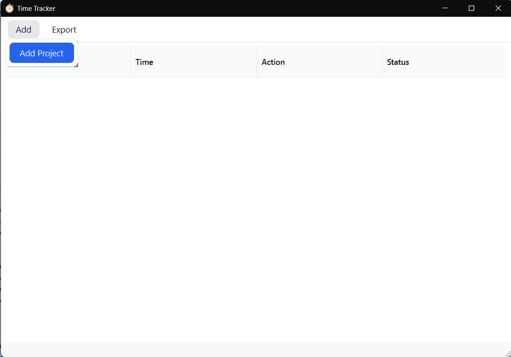
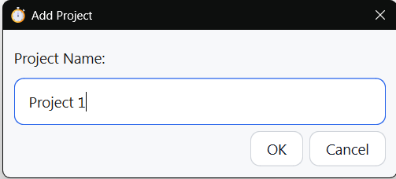

2. **Add Tasks**
   - Right-click on a project in the tree view
   - Select "Add Task"
   - Enter a task name and click OK

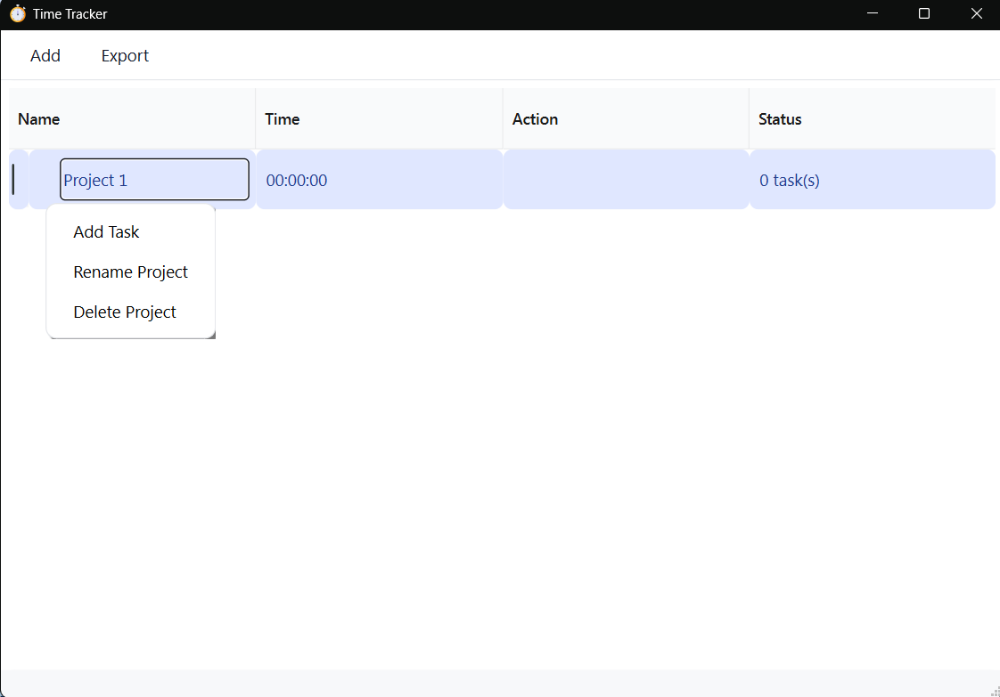
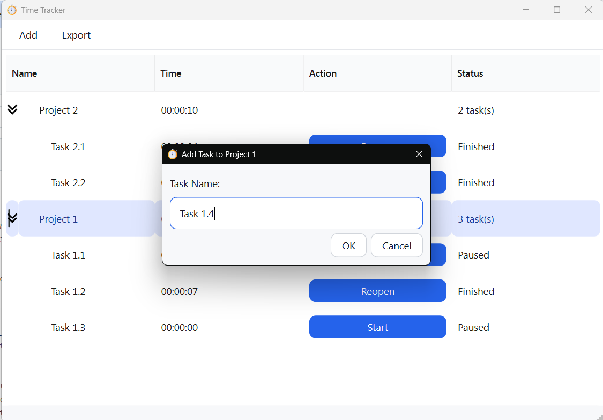
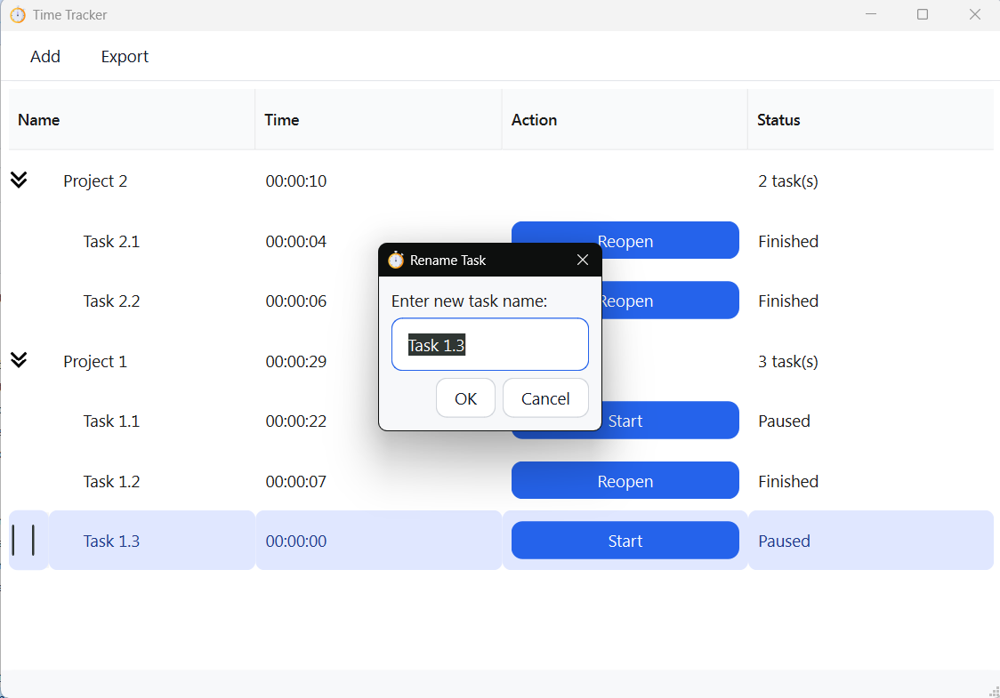

3. **Track Time**
   - Click the "Start" button next to a task to begin tracking
   - The timer will update every second
   - Click "Pause" to temporarily stop the timer
   - Click "Start" again to resume from where you left off
   - Tracking more than one task at a time is not allowed
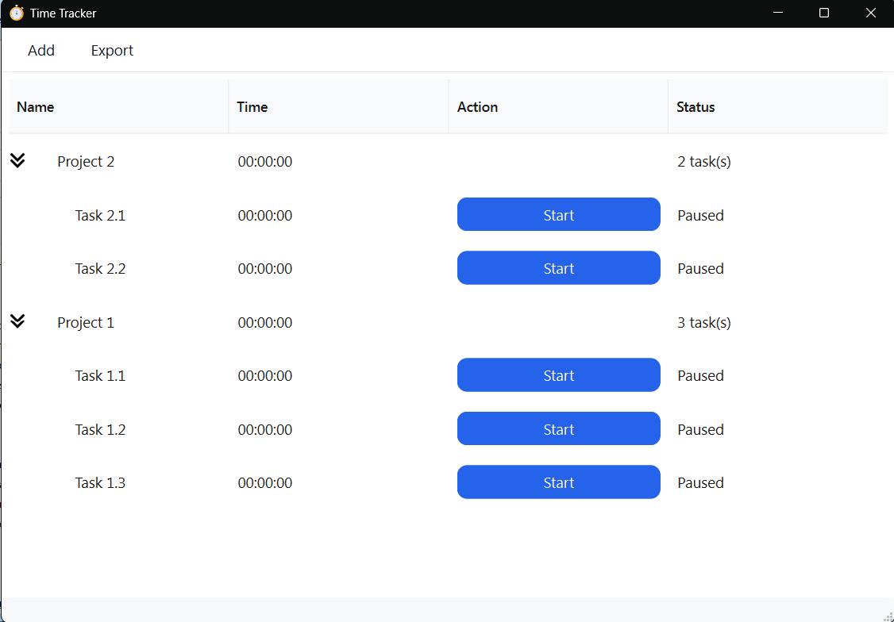
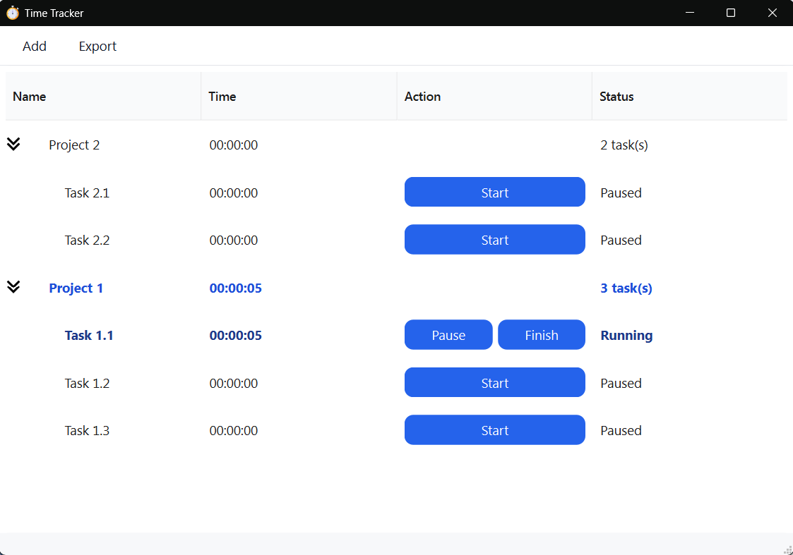
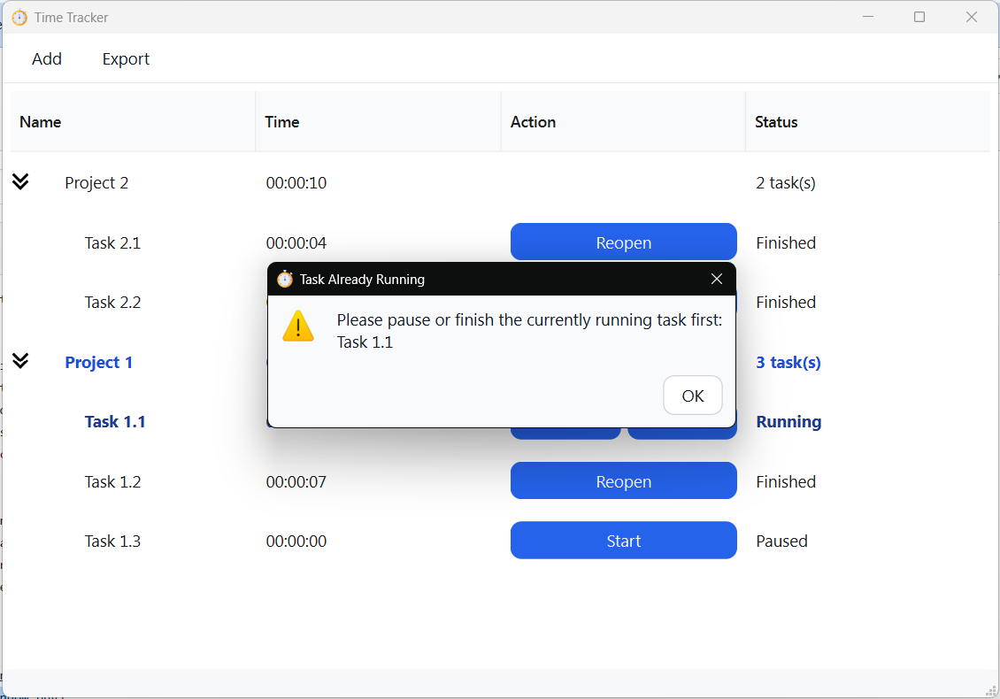

4. **Finish Tasks**
   - Click "Finish" when a task is complete
   - Finished tasks can be reopened later if needed


5. **Edit Tasks**
   - Right Click on a task
   - Rename or Delete task
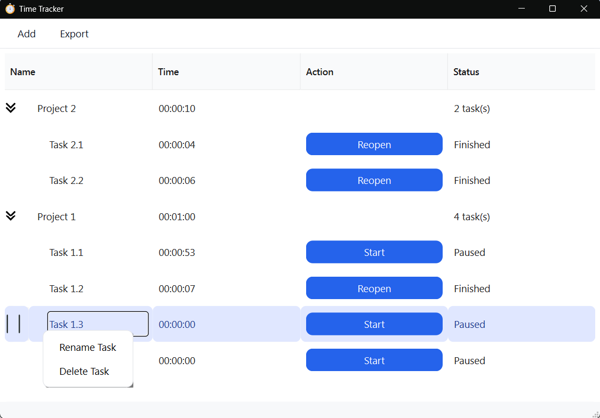
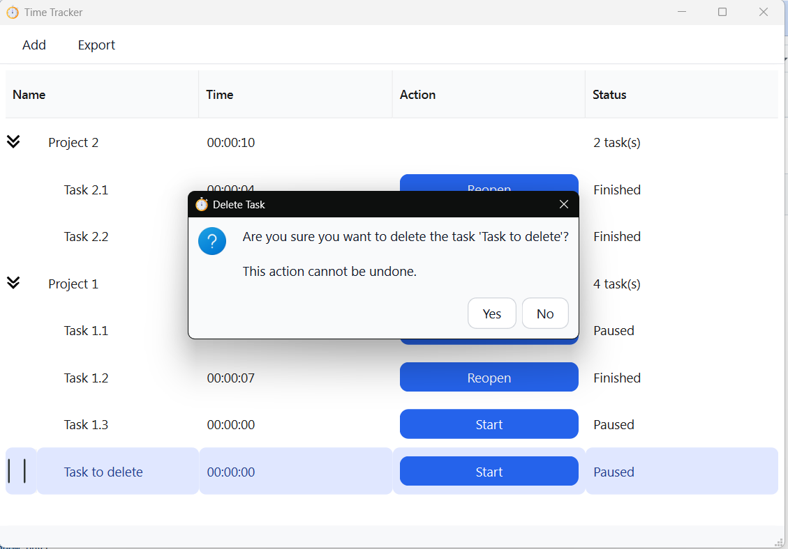


6. **Export Reports**
   - Click on "Export" in menu
   - Choose to export to .csv or .xlsx
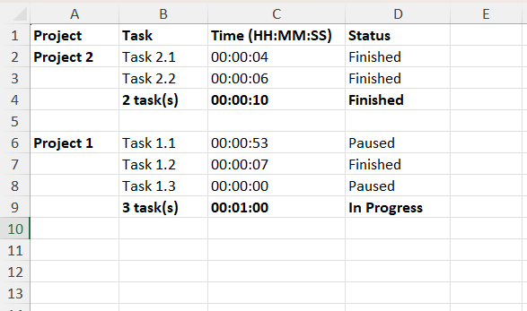
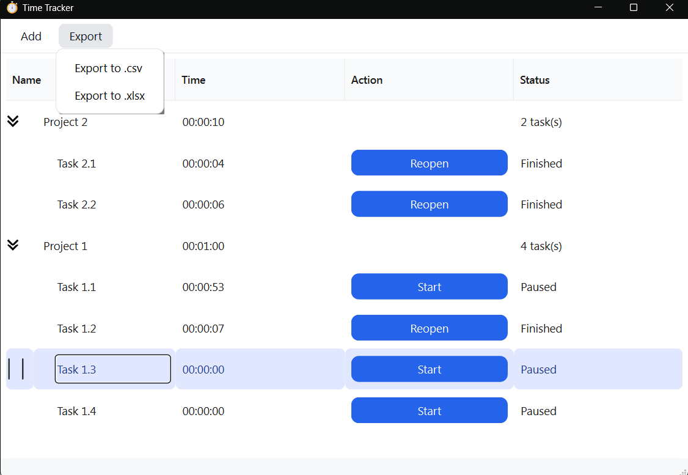


### Context Menu Actions

**Right-click on a Project:**
- Add Task
- Rename Project
- Delete Project (also deletes all tasks)

**Right-click on a Task:**
- Rename Task
- Delete Task (cannot delete running tasks)

### Exporting Data

1. Click "Export to .csv" or "Export to .xlsx" in the toolbar
2. Choose where to save the file
3. Open the file in Excel or any spreadsheet application

The file includes:
- Project names with total time
- All tasks with individual times
- Task status (Running, Paused, Finished)

## Project Structure

```
TimeTracker/
├── main.py                    # Main application file
├── database_manager.py        # Database operations
├── database_setup.py          # Initial database setup (deprecated)
├── assets                    # Includes Application icons
├── build_exe.bat             # Build script for single exe
├── ui/
│   ├── main_window.ui        # Main window design
│   ├── add_project_dialog.ui # Add project dialog
│   └── add_task_dialog.ui    # Add task dialog
├── database/
│   └── timetracker.db        # SQLite database (auto-created)
└── exports/                  # Default location for CSV exports
```

## Database Schema

### Projects Table
- `id`: Primary key
- `name`: Project name
- `created_at`: Timestamp

### Tasks Table
- `id`: Primary key
- `project_id`: Foreign key to projects
- `name`: Task name
- `total_seconds`: Accumulated time in seconds
- `is_finished`: Boolean flag (0 or 1)
- `is_running`: Boolean flag (0 or 1)
- `created_at`: Timestamp

## Technology Stack

- **Language**: Python 3.10+
- **GUI Framework**: PyQt6
- **Database**: SQLite3
- **UI Design**: Qt Designer
- **Packaging**: PyInstaller

## Icon Attributions

**Timer icon**
- Author: Freepik
- Source: https://www.flaticon.com/free-icons/timer
- License: Flaticon Free License

**Right Arrow icon** 
- Author: Freepik, Arkinasi
- Source: https://www.flaticon.com/free-icons/next
- License: Flaticon Free License

**Double Arrow icon** 
- Author: Freepik, Arkinasi
- Source: https://www.flaticon.com/free-icons/double-arrow
- License: Flaticon Free License

## License

**Copyright © 2026 [Hanré Delport]. All rights reserved.**

This software is provided for personal, non-commercial use only. 

### Terms of Use

- ✅ **Permitted**: Personal use, modification for personal use, learning purposes
- ❌ **Prohibited**: Commercial use, distribution for profit, incorporation into commercial products
- 📧 **Commercial Licensing**: For commercial use or redistribution, please contact [hanredelport@gmail.com]

## Contributing

This is a personal project, but suggestions and bug reports are welcome! Please open an issue on GitHub.

## Future Features (Roadmap)

Potential features for future development:
- Invoice generation based on tracked time
- Multiple user support
- Cloud backup integration
- Reporting and analytics
- Keyboard shortcuts
- Task notes and descriptions

### Version 1.0.0 (2026-01-27)
- Initial release
- Project and task management
- Time tracking with start/pause/finish functionality
- CSV export
- Local SQLite database
- Windows desktop application

---
